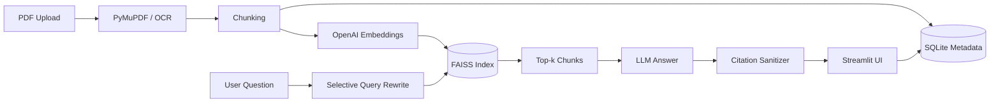

# HKMU AI Study Assistant

A persistent multi-PDF conversational RAG application for university course materials, built as a portfolio project around retrieval quality, citations, document lifecycle management, and local persistence.

## Why this project

Students often study from many PDFs at once. A useful assistant needs more than a chat box: it should persist documents across sessions, retrieve evidence from the right pages, cite answers, handle scanned PDFs, avoid duplicate uploads, and expose enough observability to debug failures.

## Highlights

- Multi-PDF retrieval with persistent **FAISS** indexing
- **SQLite** persistence for documents, chunks, chat history, and usage analytics
- Incremental upload/delete flows without rebuilding the entire knowledge base
- SHA-256 duplicate detection
- Text extraction with selective **Tesseract OCR** fallback
- Page-level citations with invalid-marker sanitization and citation-coverage reporting
- Context-aware query rewriting only for dependent follow-up questions
- Streamlit UI with document management and observability
- Deterministic core + integration tests using fake LLM/embedding providers
- Docker deployment support

## Architecture



## Repository layout

```text
.
├── app.py                 # Streamlit application
├── src/
│   ├── rag_engine.py      # Retrieval + generation orchestration
│   ├── vector_index.py    # FAISS persistence and search
│   ├── repository.py      # SQLite-backed repository layer
│   ├── pdf_service.py     # PDF parsing and OCR fallback
│   └── citations.py       # Citation construction/validation
├── tests/                 # Core + offline deterministic integration tests
├── .github/workflows/     # CI: install dependencies and run pytest
├── Dockerfile
└── requirements.txt
```

## Local setup

```bash
python -m venv .venv
source .venv/bin/activate   # Windows: .venv\Scripts\activate
pip install -r requirements.txt
cp .env.example .env
# Add OPENAI_API_KEY to .env
streamlit run app.py
```

For OCR, install Tesseract and the language packs you need. The Docker image includes English OCR support.

## Test

```bash
python -m pytest
```

Core persistence/citation tests run without an API key. Full RAG tests use fake providers, so they are deterministic and do not call OpenAI. See `TEST_REPORT.md` for the verification boundary.

## Persistence and privacy

Runtime files are intentionally excluded from Git:

- `data/app.db`
- `data/indexes/*.faiss`
- uploaded PDFs
- logs
- `.env`

Do not commit course PDFs, API keys, or generated local databases.

## Current limitations

- SQLite + local FAISS target a single-user portfolio deployment, not horizontal scaling.
- OCR quality depends on scan resolution and installed language packs.
- Citation coverage measures citation presence, not semantic entailment.
- A labelled retrieval/answer evaluation set would be the next step for rigorous RAG quality measurement.

## Next improvements

- Add a small labelled RAG evaluation set (retrieval recall + citation faithfulness)
- Add reranking for harder multi-document questions
- Add model/provider abstraction and cost controls
- Deploy a public demo using sample, non-copyrighted documents

## Portfolio verification

- Local dependency-light/core test run: **5 passed** during portfolio cleanup.
- Runtime secrets, uploaded PDFs, local FAISS indexes, SQLite databases, and logs are excluded from Git.
- The repository avoids claiming retrieval quality beyond what has actually been evaluated; a labelled RAG benchmark remains a future improvement.

## Research preparation

- Research questions and hypotheses: [`RESEARCH_PROTOCOL.md`](./RESEARCH_PROTOCOL.md)
- Reproducibility/evaluation workflow: [`REPRODUCIBILITY.md`](./REPRODUCIBILITY.md)
- Offline retrieval/citation evaluator: `scripts/evaluate_retrieval.py`

The project is presented as a **research prototype** until a labelled retrieval/answer benchmark is run; no retrieval-quality number is invented.
